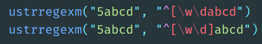

# Regular Expressions

[Here's the best regular expressions tutorial I've found.][ryans_tutorials_regex] It's concise and easy to follow.

[Regex101](https://regex101.com/) is also very helpful to interactively write regular expressions before using a string on actual data. PCRE is the correct flavor to use for Stata, assuming you're using the [unicode regex functions](#regex-commands).

[ryans_tutorials_regex]: https://ryanstutorials.net/regular-expressions-tutorial/

## Regular Expressions with Stata

### Regex commands

Stata's default regex engine (i.e. the `regexm`, `regexr`, and `regexs` functions) is annoyingly incomplete. It doesn't include many of the features available by default in other programs like backreferences, lookarounds, and repetitions. _Thankfully_, the Unicode regex functions (`ustrregexm`, `ustrregexrf`, `ustrregexra`, `ustrregexs`), available since Stata 14, do provide all standard regex features.

Incredibly, the fact that these functions provide access to features not available in the original functions isn't documented _anywhere_ in Stata's documentation.

I exclusively use the newer unicode regular expression functions. Here are all the features that exist solely in Stata's unicode regex functions:

- [Braced multipliers](https://ryanstutorials.net/regular-expressions-tutorial/regular-expressions-basics.php#multipliers): `[0-9]{10}` would match 10 digits in a row.
- [Character classes](https://ryanstutorials.net/regular-expressions-tutorial/regular-expressions-intermediate.php#shorthand): `\d{10}` would also match 10 digits in a row.
- [Word boundaries](https://ryanstutorials.net/regular-expressions-tutorial/regular-expressions-intermediate.php#wordbountaries): `\b(pre)\b` would match `pre` but not `prefix`.
- [Backreferences](https://ryanstutorials.net/regular-expressions-tutorial/regular-expressions-advanced.php#backreferences)
- [Lookaheads and Lookbehinds](https://ryanstutorials.net/regular-expressions-tutorial/regular-expressions-advanced.php#lookahead): `(?=3)\d{4}` would match any four-digit number starting with `3`.

[Here's the full specification](http://www.icu-project.org/userguide/regexp) of regex features available in the unicode regex engine. (Scroll down to "Regular Expression Metacharacters")

### Syntax highlighting

If you're writing regular expressions in Stata code, I would recommend using [Stata syntax highlighting in Atom](https://atom.io/packages/language-stata), which highlights individual parts of regular expressions to make it easier to find an error.

Suppose you want to match a string that consists of either a number or a letter, then `abcd`. You probably want to use a _class_ to allow either a number or a string (the `[\w\d]`), and then want to match a literal `abcd`. In the first line, it's easy to see that you forgot the closing `]` because `abcd` is red.

